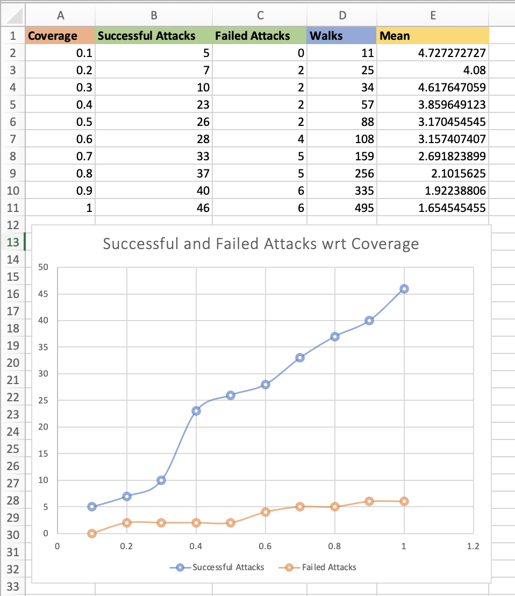

# CS441_Fall2023_HW2
## Swetha Gumpena
### UIN: 670605665
### NetID: sgumpe2@uic.edu

Repo for the Spark Homework-2 for CS441-Fall2023

---

AWS EMR Deployment video link: https://youtu.be/BpMLJzGaZjY

---

## Environment:
**OS** : Mac OS

---

## Prerequisites:
- SBT
- Spark Version 3.4.1
- Java 11

---

## Running the project
1) Download the repo from git
2) The root file is found in _src/main/scala/MainClass.scala_
3) Run `sbt clean compile` from the terminal
4) Run `sbt "run <input-path> <output-path>"` without the angular braces
5) Run `sbt test` to test
6) To create the jar file, run the command `sbt -mem 2048 assembly`
7) The resulting jar file can be found at _target/scala-2.13/graphs_mitm_attack.jar_
8) If you are running using IntelliJ, import the project into the IDE, build it and create a `configuration` for MainClass.scala. The arguments in this would be the input files (original graph, perturbed graph, yaml of differences generated by NetGameSim) and output folder separated by a space i.e., `<.ngs file of original graph> <.ngs file of perturbed graph> <yaml of differences> <output folder>`
- Configuration example - `inputs/NetGameSimNetGraph_29-10-23-16-16-17.ngs inputs/NetGameSimNetGraph_29-10-23-16-16-17.ngs.perturbed inputs/NetGameSimNetGraph_29-10-23-16-16-17.ngs.yaml src/main/scala/resources/output`

- Make sure that your local input/output folder has the requisite permissions to allow the program to read and write to it

---

### Parameters
1. Sample input path - ```inputs/NetGameSimNetGraph_29-10-23-16-16-17.ngs inputs/NetGameSimNetGraph_29-10-23-16-16-17.ngs.perturbed inputs/NetGameSimNetGraph_29-10-23-16-16-17.ngs.yaml```
2. Sample output path - ```src/main/scala/resources/output```

---

## Requirements:

In this homework, we have to perform parallel random walks on large graphs to simulate how MitM (Man in the Middle) attackers work. Each node in the original graph has the attribute `Valuable Data` that specifies whether a given computer holds some sensitive data. Of course, the insider MitM attacker knows the original graph because the attacker is an insider, however, s/he does not know whether the nodes that represent computers in the perturbed graph are authentic or not. Making a mistake and choosing a honeypot believing that it is the valuable data computer results in the security systems detecting the attacker and disabling the malicious program.


1) Create a number of random walks on the perturbed graph in parallel. 
2) For each node in a computed path of the random walk you will compute the likelihood that a node matches a specific node in the original graph using SimRank. If the likelihood score is above your chosen threshold then a matching node/computer is found in the original graph and if there are more then one matches then you can make a choice at random. 
3) If a match between nodes is determined, and it is actually verified as correct and if the node contains valuable data then the attack is considered successful. 
4) However, if a match is found, but it is a false positive and the node's attribute specifies that it contains valuable data then the attacker is destroyed. 
5) Next, if no match is found then the iteration loop continues by going to the first step and repeating a random walk using the information about retrieved nodes from the previous iterations. 
6) The number of iterations is a configurable parameter that may designate a threshold for the number experiments, or it can be based on the threshold for the total elapsed running time. 
7) Finally, you will produce metrics about your algorithm i.e., the number of successful attacks and the failed attacks for a given number of iterations, min/max/mean number of nodes in these walks and the ratio of the number of random walks resulting in successful attacks to the total number of random walks.

Other Requirements:

1) 5 or more scala tests should be implemented 
2) Logging used for all programs 
3) Configurable input and output paths for the program 
4) Compilable through sbt 
5) Deployed on AWS EMR

---

## Technical Design

We will take a look at the detailed description of how each of these pieces of code work below. Line by line comments explaining every step are also added to the source code in this git repo:

1) ### [Main.scala](src/main/scala/Main.scala)
    This is the main method that we call to run our application. It takes our input and output path. Our input comprises the .ngs file of original graph, .ngs file of perturbed graph and YAML file that has the differences between the original and perturbed graph generated by NetGraphSim.
- Load the original and perturbed graphs using a custom function _(LoadGraph.load)_ and get the nodes and edges
- Create a Spark context (Creation varies for local deployment and AWS deployment)
- Create an RDD for nodes and edges. RDD is an immutable, distributed collection of objects, partitioned across the nodes of a cluster, that can be operated on in parallel. RDDs allow for distributed data processing across a cluster of machines. Data is divided into partitions and processed in parallel, which can lead to significant performance improvements
- Vertices RDD (RDD[(VertexId, V)]):
  This RDD represents the vertices of the graph. It's a collection of tuples where the first element is the vertex ID (VertexId) and the second element is the property or information associated with that vertex (V)
- Edges RDD (RDD[Edge[E]]):
  This RDD represents the edges of the graph. It's a collection of Edge objects where each Edge contains source vertex ID, destination vertex ID, and the edge property or information (E)
- We then use GraphX to create a Graph from the nodes and edges RDD
  GraphX is a distributed graph processing framework that extends the core Spark API to include graph processing capabilities. It provides a set of high-level APIs for working with graphs and performing graph computations in a distributed manner
- I have configurable parameters for the max length of a random walk and coverage (percentage of nodes to be covered)
- An accumulator is defined to keep track of the visited nodes. This data acts as feedback for the subsequent walks. This is to ensure we don't traverse the same node more than once
- A starting node is chosen at random and a random walk is performed _(GraphWalk.randomWalk)_. This goes on to find a path using the neighbors upto the max length of the walk
- When a neighbor is encountered that has already been visited, the walk is terminated
- In each walk, we find the similarity for each node of the walk using _(FindMatchingElement.matchedElement)_. If a matched element is found which satisfies the similarity threshold requirement, we then check if we should attack it or not
- We load the list of addedNodes, modifiedNodes and removedNodes by parsing the YAML got from NetGraphSim using _ParseYAML.parseFile()_
- The conditions are:
  - If the original node contains valuable data (= True) we attack it. If the original node does not contain valuable data (= False) we do not attack it
  - If the node is decided to be attacked: if the perturbed node is an added node or the original node is a modified node, then it is a "Failed Attack"
  - If the node is decided to be attacked: if the original node a removed node or the original node is an unchanged node, then it is a "Successful Attack"  
- _**Successful Attack**_ - If the original node is valuable and the attacker finds the closest match to this node that is removed or unchanged, s/he successfully found a valuable node, attacks it and draws valuable information
- _**Failed Attack**_ - If the original node is valuable and finds the closest match to a node that is added or modified, s/he encountered a honeypot that was purposely placed which very much resembles an actual node but was used to deceive attackers. This results in a failed attack and the attacker is busted
- Random walks are generated until the coverage is met. Here, coverage means the percentage of nodes we want to traverse. For instance, I've set my coverage to be 0.9. This means I would terminate by program after visiting 90% of the nodes. This is done to ensure that all nodes are not visited which could lead to a higher probability of the attacker being caught
- Different metrics are computed and finally written to a results file. The metrics computed are:
  - Number of successful and failed attacks for a given number of iterations
  - Minimum number of nodes in a random walk
  - Maximum number of nodes in a random walk
  - Mean number of nodes in a random walk
  - Ratio of number of random walks resulting in successful attacks to the total number of random walks


2) ### [LoadGraph.scala](src/main/scala/utils/LoadGraph.scala)
- The load function loads data from a specified file or URL. It expects a file path or URL as input and returns a tuple containing two lists: one with NodeObject instances and another with Action instances
- The function takes a single parameter filePath, which is a string representing the path to a file or a URL 
- It first checks if the filePath starts with either "http://" or "https://", indicating that it is a URL. 
  - If it is a URL, it attempts to open an input stream to read the data from the URL using new URL(filePath).openStream(). This operation is wrapped in a Try block to handle any potential exceptions
  - If it is not a URL, it assumes it is a file path. It attempts to open an input stream to read the data from the file using new FileInputStream(filePath). Again, this operation is wrapped in a Try block 
- The result of attempting to open the stream is stored in the inputStream variable, which is of type Option[InputStream]. This means it can either be Some(inputStream) if the stream was successfully opened or None if there was an error
- It returns a tuple (nodes, edges) containing the lists of nodes and edges 
- If inputStream is None, it means there was an error opening the stream. In this case, it throws an IllegalArgumentException with the message "Invalid file path or URL"

3) ### [GraphWalk.scala](src/main/scala/utils/GraphWalk.scala) 
- Performs a random walk on a given graph starting from a specified node
- It takes four parameters:
    - graph: A GraphX graph containing nodes of type NodeObject and edges of type Action
    - startNode: The initial node where the random walk begins, specified by its VertexId
    - maxSteps: The maximum number of steps allowed for the random walk
    - visitedNodesAcc: A CollectionAccumulator that keeps track of visited nodes during the random walk
- The function is defined recursively within the randomWalkRecursive function
- Inside the randomWalkRecursive function, there is a termination condition defined by the base case of the recursion:
    - If the number of steps taken (steps) is greater than or equal to maxSteps - 1, or
    - If the startNode is already in the set of visited nodes, the function returns the current path in reverse order
- If the termination condition is not met, the function proceeds to explore the neighbors of the current node
- It filters the edges of the graph to find all the edges where the source node matches the current node (currentNode). Then it extracts the destination nodes (neighbors) from these edges
- If there are no neighbors, it means the current node is a leaf node, and it returns the current path in reverse order
- If there are neighbors, it filters out the unvisited ones by checking if they are not in the set of visited nodes (visitedNodesAcc.value)
- If all neighbors are visited, it means the current node is in a dead end, and it returns the current path in reverse order
- If there are unvisited neighbors, it randomly selects one of them using _Random.nextInt(unvisitedNeighbors.length)_
- The function then recursively calls itself with the selected neighbor as the new current node, increments the step count (steps + 1), and adds the new node to the path
- The random walk continues until one of the termination conditions is met, and the function eventually returns the path taken during the random walk

4) ### [FindMatchingElement.scala](src/main/scala/utils/FindMatchingElement.scala)
- **jaccardSimilarity** Function:
  - This function takes two NodeObject instances, perturbedNodeObject and originalNodeObject, as input
  - It first converts both NodeObject instances into sets of integers using their toSet method
  - It calculates the Jaccard Similarity between the sets, which is defined as the size of the intersection divided by the size of the union of the sets
  - If the union size is 0 (indicating both sets are empty), it returns 0.0 to avoid division by zero errors. Otherwise, it returns the Jaccard Similarity.
- **matchedElement** Function:
  - This function takes a perturbedNode (a NodeObject) and an array of originalNodes (an array of NodeObject instances) as input 
  - It extracts the similarity threshold for matching from the configuration file
  - It applies the jaccardSimilarity function to calculate the similarity score between the perturbedNode and each originalNode
  - It filters out the elements where the similarity score is below the specified threshold
  - If there are matching elements (i.e., the matchingElementArr is not empty), it finds the element with the highest similarity score
  - It returns an Option containing a tuple (originalNodeId, perturbedNodeId, similarityScore) representing the matching element if one exists. Otherwise, it returns None

---

## Results
Sample results are shown below. This demonstrates the nodes that have been successfully attacked and the instances where the attacker attacked a honeypot along with other metrics
```
  Nodes With Valuable Data: 3, 12, 15, 17, 23, 38, 41, 42, 49, 64, 76, 80, 97, 105, 136, 148, 160, 167, 177, 182, 187, 233, 239, 242, 243, 254, 256, 266, 285, 291, 297, 300, 313, 336, 342, 348, 357, 363, 365, 373, 377, 383, 389, 390, 401, 423, 425, 431, 442, 460, 466, 480
  
  Coverage: 90.0%
  Number of Random Walks: 326
  Successful Attacks: 365, 42, 411, 297, 256, 41, 266, 291, 342, 336, 363, 383, 442, 254, 357, 460, 348, 480, 233, 220, 97, 285, 425, 64, 17, 12, 313, 49, 187, 377, 76, 3, 80, 167, 177, 182, 390, 401, 23, 300, 373, 239, 242
  Failed Attacks: 466, 518, 515, 160
  Number of Successful Attacks: 43
  Number of Failed Attacks: 4
  
  Minimum Number of Nodes in a Walk: 1
  Maximum Number of Nodes in a Walk: 10
  Mean Number of Nodes in a Walk: 1.9417177914110428
  Ratio of Number of Random Walks resulting in Successful Attacks to the Total Number of Random Walks: 0.17484662576687116
```
Below is the demonstration of the number of Successful and Failed Attacks for different values of coverage  
- When the coverage is low: lesser number of walks are computed, which results in less nodes being visited and eventually lesser number of attacks  
- As the coverage increases: more attacks are being performed  


---

## Test Cases
These are run through the command `sbt test`

